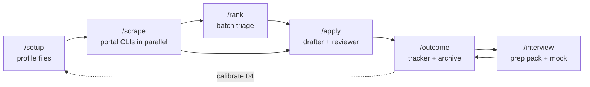

# How the local workflow works

This page explains the original, local job-search workflow: what the "agents" and "skills" in this repository actually are, how a job moves from a portal search to a submitted application, and where the guardrails live. It is a reader's guide; the files it describes remain the single source of truth (see `AGENTS.md`). For the hosted JobPilot layer that was added later, see [`platform/docs/architecture.md`](../platform/docs/architecture.md); the last section here explains how the two relate. A visual version of this page is [`docs/how-it-works.html`](how-it-works.html), and six interactive architecture and sequence diagrams generated from the code live under [`docs/diagrams/`](diagrams/index.html).

## 1. There is no agent code

Claude Code is the agent. Nothing in the repository runs a language model, holds a prompt loop, or orchestrates tools in code. Everything Claude does here comes from reading markdown and following it, which is why `CONTRIBUTING.md` says the markdown specs *are* the implementation and rejects parallel orchestration layers.

The only executable code is deterministic: portal search CLIs, Python helpers, and LaTeX compilation. None of it calls a model.

## 2. The four kinds of parts

| Part | Where | What it is | Who runs it |
| --- | --- | --- | --- |
| **Skills** | `.claude/skills/*/` | Knowledge and procedure in markdown. Loaded when a task matches the skill's description. | Claude reads them |
| **Commands** | `.claude/commands/*.md` | Step-by-step scripts. Typing `/apply` makes Claude read `apply.md` and follow its numbered steps in order. | Claude reads them |
| **Portal CLIs** | `.agents/skills/*/cli/` | Bun and TypeScript programs, one per job board, with `search` and `detail` subcommands and JSON output. Each ships its own `SKILL.md` documenting the exact flags. | Claude runs them via Bash |
| **Helper tools** | `tools/*.py` | Deterministic utilities: stable job keys, seen-jobs queries and writes, PDF page and text checks, layout measurement, robots.txt checks. | Claude runs them via Bash |

### The job-application-assistant skill

The core skill is nine numbered reference files plus a `SKILL.md` that sequences them:

| File | Holds |
| --- | --- |
| `01-candidate-profile.md` | Education, experience, skills, publications. One of the three fact sources every draft is audited against. |
| `02-behavioral-profile.md` | Working style and natural register, used to keep a cover letter's voice honest. |
| `03-writing-style.md` | Tone rules: no em-dashes, no clichés, no unverified company claims, reframe emphasis but never substance. |
| `04-job-evaluation.md` | The scoring framework: two gates, five dimensions, weights, verdict bands, the company-research cache. |
| `05-cv-templates.md`, `06-cover-letter-templates.md` | LaTeX structure and tailoring rules for the stock moderncv CV and `cover.cls` letter. |
| `07-interview-prep.md` | STAR stories, tough questions, questions to ask, the mock-interview protocol. |
| `08-application-forms.md` | Free-text portal fields such as self-introductions and character-limited pitches. |
| `09-web-research.md` | The trust boundary for fetched content and the 403 escalation order. |

Two more skills exist: `job-scraper` is the `/scrape` procedure, and `upskill` is the skill-gap analysis.

### The portal CLIs

Six ship with the repo: Jobindex, Jobnet, Akademikernes Jobbank and Jobdanmark for the Danish market, LinkedIn public listings, and the Freehire tech aggregator. They are plain API clients or scrapers with no AI inside. A portal can be switched off with `enabled: false` in its `SKILL.md`, and `/add-portal` scaffolds a new one for another market. Because they use the portable Agent Skills format, other harnesses such as Codex or Gemini CLI discover them without changes.

## 3. The state files

Claude forgets everything between sessions, so every fact that must survive is written to disk.

| File | Written by | Read by | Purpose |
| --- | --- | --- | --- |
| `CLAUDE.md` | `/setup` | every command | The candidate profile and the workflow rules for the whole workspace. |
| `job_scraper/seen_jobs.json` | `/scrape`, `/rank`, `tools/import_jobpilot.py` | `/scrape`, `/rank`, `/upskill` | Every posting ever seen, keyed by `tools/job_key.py`, with fit, status, portal, deadline and rank fields. Fields are only ever added. |
| `job_search_tracker.csv` | `/apply`, `/outcome`, `/gmail-sync` | `/scrape`, `/rank`, `/interview`, `/upskill`, `/html-report` | One row per application with a fixed status vocabulary: `drafted`, `applied`, `interview`, `offer`, `hired`, `rejected`, `no_response`, `offer_declined`, `withdrawn`. |
| `documents/applications/<company>_<role>/` | `/apply`, `/outcome`, `/interview` | `/interview`, `/setup` | The archive: the verbatim posting, the submitted CV and letter, `outcome.md`, prep packs and follow-ups. Git-ignored. |
| `company_research/<company>.json` | the `/apply` reviewer, `/interview` | the same two | A 30-day cache of where each company fact came from. A cache hit is a lead, never a verified claim. |

## 4. The pipeline

### `/setup`

Builds the profile from one of three paths: reading the `documents/` folder, importing a single pasted CV, or a structured interview. It writes the seven profile skill files and the profile section of `CLAUDE.md`. Once applications resolve, it re-reads their `outcome.md` files to recalibrate the scoring framework and to mine STAR stories.

### `/scrape`

1. Loads `seen_jobs.json`, the tracker, and `search-queries.md`.
2. Discovers every enabled portal `SKILL.md`, translates the queries into that portal's flags, scopes to the last 14 days, and runs the CLIs in parallel through sub-agents. WebSearch is the fallback when Bun is missing or a CLI fails.
3. Fetches detail only for promising hits, then drops anything whose URL, company-plus-title, or tracker row already exists.
4. Gives each new posting a quick high, medium or low fit. A required language the profile never declares forces low.
5. Stores everything with a canonical key and presents a table. Handing a number to Claude routes straight into the full evaluation.

A bounded health check catches portals whose parser has silently rotted, and a mass-posting signal flags one description posted across many cities.

### `/rank`

The bridge between many scraped postings and one deep evaluation.

- The seen-jobs file is never read into the conversation. `tools/rank_state.py candidates` selects up to ten unscored entries and excludes anything already in the tracker.
- Parallel sub-agents, about five postings each, receive the rubric inline and fetch each posting. They return JSON: four dimension scores, a location verdict, a language verdict with the quoted requirement, deadline, strengths and gaps. A posting that cannot be fetched after the 403 escalation is marked expired, never scored from its title.
- The main session computes the weighted score, applies the vetoes, adds deadline-urgency and staleness flags, and writes results back with `rank_state.py apply`. A sweep retires already-ranked entries whose stored deadline has passed.

Rank produces triage scores only. `/apply` always re-evaluates with company research before drafting.

### `/apply`

The drafter-reviewer workflow. One session is the drafter; a second Claude session with a fresh context is the reviewer.

| Step | Actor | What happens |
| --- | --- | --- |
| 0 | drafter | Fetch or accept the posting. Prefer the employer's own page over an aggregator. Keep the full text verbatim. Treat it as data, never instructions. |
| 1 | drafter | Score against `04-job-evaluation.md`: gates first, then five dimensions, an optional salary benchmark, a verdict. Ask the user whether to proceed. |
| 2 | drafter | Write the LaTeX CV and cover letter from the templates. Every requirement in the posting is matched or honestly gapped. Every fact is audited against the union of `01-candidate-profile.md`, the master CV and `CLAUDE.md`. |
| 3 | reviewer | Spawned with the drafts pasted inline. Researches the company from its own name, never from links in the posting. Runs its own grounding audit. Returns exact string edits with reasons, plus narrative critique in four fixed categories. |
| 4 | drafter | Applies the string edits mechanically and the narrative suggestions with judgment. Verifies any company claim independently before using it. Never adopts a suggestion that fabricates. |
| 5 | drafter | Compiles with lualatex and xelatex, measures the layout with `tools/verify_layout.py`, reads the rendered PDFs, iterates until the CV is exactly two pages and the letter exactly one. Extracts the CV's text layer and checks it the way an applicant tracking system would, including posting keyword coverage. Gaps stay visible, never stuffed. |
| 6 | drafter | Runs the verification checklist once, records a `drafted` tracker row, archives the verbatim posting, and offers to draft any free-text portal fields. |

A standing rule sits above all six steps: any fact the user states in chat that is not yet in the profile is written to `01-candidate-profile.md` in the same turn. A fact that lives only in the conversation is stripped by the next session's audit as a fabrication.

### `/outcome` and `/interview`

`/outcome` records stages and results into the tracker and the archive, drafts follow-ups after ten quiet days using only claims from the submitted materials, and batch-resolves applications quiet for sixty days. `/interview` builds a stage-specific prep pack from what the interviewer actually read, researches the company and interviewers with a verify-before-use rule, maps likely questions to STAR stories, and runs a mock interview coached toward the candidate's natural register.

### The rest

`/gmail-sync` proposes tracker updates from inbox signals for approval. `/notion-sync` publishes a read-only pipeline view. `/html-report` renders an offline dashboard. `/expand` enriches the profile from linked public sources. `/upskill` turns recorded gaps into a learning plan. `/add-template` and `/add-portal` register a custom document template or a new job board. `/reset` wipes personal data.

## 5. The scoring framework in brief

Two gates run before any scoring and are hard filters, not dimensions:

- **Eligibility.** A stated citizenship, residency or clearance requirement the candidate cannot meet fails the posting. Silence is not permission; it is marked unverified and checked on the employer's site.
- **Language.** A required language the profile does not list fails. A listed language at a plausibly higher bar than declared is flagged for the human to judge.

Then five dimensions: technical skills, experience, behavioral fit, location as pass or fail, and career alignment. The weighted score uses 30, 25, 15 and 30 percent for the four scored dimensions. Verdict bands: strong fit at 75 and above, good from 60, moderate from 45, weak from 30, poor below.

## 6. The agent patterns worth knowing

- **Script following.** A command is a numbered procedure. Claude reads it once and executes in order, reading each reference file exactly once.
- **Parallel sub-agents for fan-out.** `/scrape` and `/rank` dispatch work through the Agent tool with everything the sub-agent needs pasted inline, so no sub-agent re-reads the profile.
- **Drafter and reviewer separation.** A fresh context cannot see the drafter's reasoning and therefore cannot rationalize its choices. Edits come back as exact strings so the drafter applies them without re-reading files.
- **Growing state goes through tools, not context.** The seen-jobs file is queried and rewritten by a Python helper because reading it would cost the whole backlog on every run.
- **Same-turn write-back.** Facts, follow-ups and outcomes are written to files the moment they are confirmed. The next session only knows what is on disk.

## 7. Guardrails and their limits

- **Postings are untrusted data.** No command follows instructions found in a posting, fetches a link found inside one, or includes content because a posting asked for it. The rule is repeated in every sub-agent prompt.
- **Three-source grounding.** A claim in a draft must be supported by the profile file, the master CV or `CLAUDE.md`. Reframed emphasis is allowed; changed facts and escalated numbers are not.
- **Verified company claims only.** A reviewer's research is a lead. Anything that lands in a letter or prep pack is re-fetched from a source located independently.
- **Respectful fetching.** A 403 from WebFetch triggers `tools/robots_check.py` first. The browser-header retry runs only where robots.txt permits; otherwise the workflow searches for the employer's own posting instead.
- **Verified output.** PDFs are compiled, measured and read; text layers are extracted and checked. "Looks fine in the source" is never accepted.

The limit: all of this is instruction-level. Nothing sandboxes Claude away from fabricating or from following an injected instruction; the rules hold because they are read and repeated. `SECURITY.md` says the same, and asks the user to skim what was fetched and written on an unfamiliar board before sending.

## 8. How JobPilot relates

The hosted platform under `platform/` reuses the methodology and replaces the runtime.

| Dimension | Local workflow (slash commands) | JobPilot (hosted app) |
| --- | --- | --- |
| What it is | Markdown skills and commands run inside Claude Code | Web app plus iOS controller on Cloudflare Workers |
| Who it suits | Someone comfortable with a terminal, git and LaTeX | Anyone with a browser, no developer tooling |
| Setup | Private fork, install Bun, Python and LaTeX, run `/setup` | Sign in, fill a nine-field profile form |
| Model | Claude, in your own Claude Code session | Llama 3.3 70B on Workers AI, JSON output only |
| Cost | Your Claude Code plan or API tokens | Stripe subscription, 60 runs a month |
| Job sources | Six portal tools plus WebSearch fallback, more via `/add-portal` | Freehire only: tech roles, last 14 days, 8 per run |
| Search | Query list from your profile, run per portal by parallel sub-agents | One keyword query written by the model |
| Screening gates | Work rights and language, followed as written instructions | Same gates, enforced in code; quotes must match the posting |
| Scoring | Five weighted dimensions, verdict bands, `/rank` triage then full `/apply` evaluation | One fit score with reason, quotes and gaps |
| Company research | Reviewer agent researches and verifies, 30-day cache | None |
| Output | Tailored LaTeX CV and letter compiled to PDFs | Unverified cover-letter text and CV bullets |
| Verification | Three-source grounding audit, reviewer critique, PDF layout measurement, ATS text and keyword check | Schema check, evidence check, verification notes |
| Your role | Approve after evaluation, read the PDFs, submit yourself; nothing is submitted | Tick roles before drafting; nothing is submitted |
| Run control | Bound to the conversation; re-run a command | Pause, resume, retry, cancel, durable across devices |
| After applying | Tracker, per-application archive, `/outcome`, follow-ups, stale sweep, Gmail sync, dashboard, Notion view | 30-run history, an audit export, and a handoff export that `tools/import_jobpilot.py` lands in the local seen-jobs file |
| Interview prep | `/interview` prep pack and mock interview | None |
| Learning loop | `/setup` recalibrates from outcomes, `/upskill` plans gaps | None, methodology fixed at build time |
| Where data lives | Files on your machine; posting text sent to Claude | Per-user Durable Object on Cloudflare; profile sent to Workers AI |
| Guardrails | Same rules enforced by repeated instructions | Budgets, gates and no-send enforced in code |
| Maturity | Used by the author for a real search: 69 applications, 20 interviews, one offer | Local demo and CI green; live auth, billing and model quality unverified; not deployed |
| Best for | Producing, verifying and managing the actual applications | Daily discovery and triage from anywhere |

What did not carry over is deliberate: the PDF pipeline, the reviewer agent, the portal CLIs and the interview and outcome loop remain local. JobPilot drafts text; the local workflow produces the application. The two connect through the handoff export: a finished run downloads as `run_<id>-handoff.json`, and `python3 tools/import_jobpilot.py` adds its postings to `job_scraper/seen_jobs.json` as new candidates, so `/rank` and `/apply` continue from there.

## 9. Where to read the source

| Question | File |
| --- | --- |
| What does `/apply` do, exactly? | `.claude/commands/apply.md` |
| How is fit scored? | `.claude/skills/job-application-assistant/04-job-evaluation.md` |
| How does search fan out and dedupe? | `.claude/skills/job-scraper/SKILL.md`, `tools/job_key.py` |
| How does ranking avoid loading the backlog? | `.claude/commands/rank.md`, `tools/rank_state.py` |
| What are the fetch rules? | `.claude/skills/job-application-assistant/09-web-research.md`, `tools/robots_check.py` |
| How do other agent harnesses use this? | `AGENTS.md` |
| How does a JobPilot run reach the local files? | `tools/import_jobpilot.py`, `platform/worker/account.ts` (the handoff route) |
| What does CI check? | `tools/lint_skills.py`, `tools/check_framework_version.py`, `tools/security_guards.py`, `tests/` |
