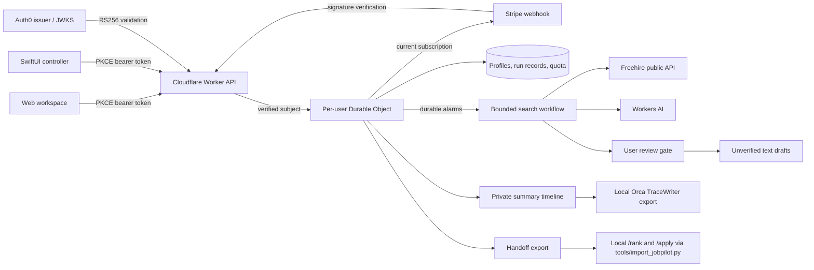

# Architecture and acceptance evidence

The application owns a narrow complete job: turn a candidate profile into a reviewed opportunity shortlist and optional application text drafts. Its authority ends before employer contact or application submission.

## Contracts

| Boundary | Enforced behavior | Evidence |
| --- | --- | --- |
| Identity | JWT issuer, RS256, audience, expiry and subject; ignore caller tenant headers | Signed local-key JWT and forgery regression tests |
| Billing | Stripe signatures and current provider state; fixed price; expiration checked again before background work | HMAC tampering/age tests, price mismatch, paywall and expiry tests |
| Spending | 60 new runs/calendar month; duplicate UUID requests reserve quota once; 20 calls/run; 3 attempts/step | State-machine limits and retry tests |
| Recovery | Profile snapshot, durable stage/cursor, alarm watchdog; step-boundary controls | Actor reconstruction test plus browser pause/reload/resume |
| Storage | Separate records keep individual values below SQLite's 2 MB limit; 30-run retention | Record-separation regression test; local workerd journey |
| External text | Fixed source origin, no user/model URL fetching; structured schemas; verbatim quote checks; output escaped in web UI | Source and schema tests; browser renders fixture postings |
| Applications | Eligibility PASS and language not FAIL required; explicit shortlist review; no send tool | Early/invalid/duplicate approval tests; completed draft journey |
| Trace | Only supported Orca schema event types, no raw profile or provider credentials, local sealing | Real Orca writer/schema integration test |
| Handoff | Evaluated postings with verbatim text, gates, decisions, drafts and applied marks; never the profile snapshot; the local import skips postings already seen by URL or key and never creates tracker rows | Route contract tests; import tool unit tests; live import against the demo |
| Clients | One API and shared durable state; independent web/native login clients, same identity audience | Browser end-to-end; Swift SDK compile (native runtime pending) |

The model selects a focused query, interprets postings, applies the canonical evaluation framework and writes drafts. The harness selects permitted stages, validates structured responses and evidence, controls costs, and authorizes transitions. Model output cannot choose a URL to fetch, a tenant, a payment price, an employer message, or an application submission action.

## Failure handling

Source and model errors transition to `failed` with a visible retry action. Failures do not create plausible empty results or switch to fixture mode. Each model request reserves its call before I/O. A durable watchdog is scheduled before a step so unexpected interruption can recover; external model calls are at-least-once and may be billed again after a crash. The call and attempt caps include retries. Timeout races bound harness waiting; they do not promise provider-side cancellation.

Commands are serialized with the current alarm step. Pause/cancel waits until that step finishes, and does not abort a model request already sent. No subsequent step begins after a persisted pause/cancel. State and alarm creation are committed together when starting a run or accepting a shortlist.

Webhook delivery order does not determine membership: the account fetches current Stripe subscriptions. Refunds, disputes, dunning behavior, tax handling and production billing policies require a finalized commercial configuration. No price is invented in the UI.

## Canonical context

`build-context.mjs` compiles `.claude/skills/job-application-assistant/04-job-evaluation.md` and `03-writing-style.md`; every run records their digest. Runtime profile data is tenant-specific. Build output is generated and ignored. The original local workflow and its PDF verification requirements continue to govern applications generated through those local commands; hosted text drafts do not claim that verification.

## Applying harness-engineering

Adapted from Ryan Lopopolo's [authority](https://github.com/lopopolo/harness-engineering/tree/trunk/docs/authority) and [proof](https://github.com/lopopolo/harness-engineering/tree/trunk/docs/proof) essays, under CC BY 4.0. Guidance was applied to this domain rather than copied as a parallel policy tree:

- Credential custody lives in Workers bindings and Keychain, outside model inputs.
- Reversible research and drafting proceed inside a bounded capability set.
- User decisions are recorded at the transition from assessment to drafting.
- Evidence names the boundary actually verified: fixtures, local runtime, SDK compile, or live external integration.

The initial evidence supports a local demo and a deployable implementation. It does not support claims of a public release, successful real payment, live model quality, or native simulator execution. See `README.md` for the remaining configured-environment checks.
